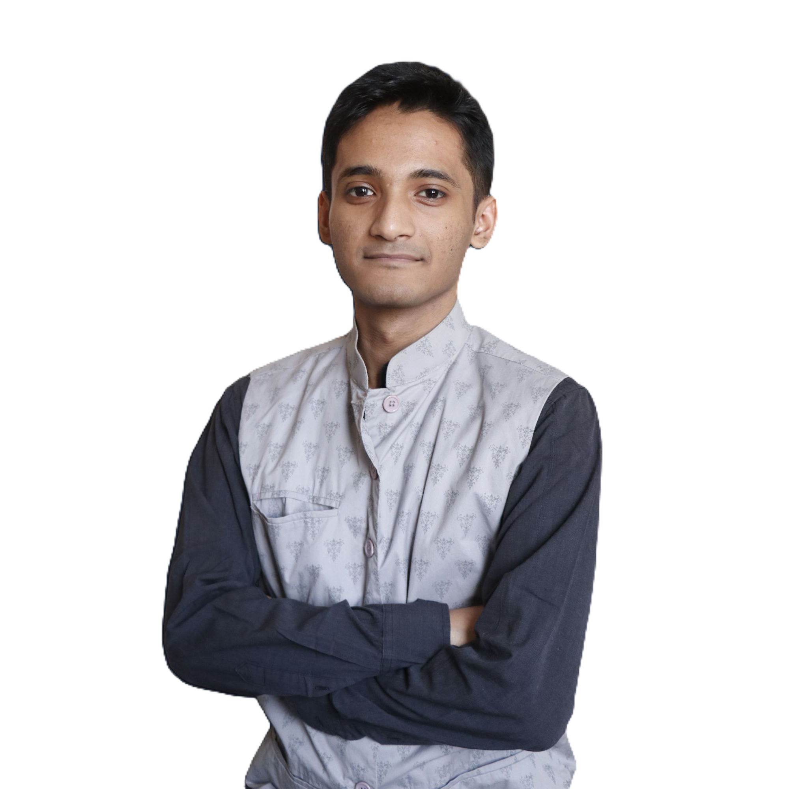

# Abir Shahadat Purab – Portfolio

  
  <h2>Mern Stack Developer</h2>
  

    
    
    
  

---

## 👋 Overview

This is my personal portfolio website, built to showcase my skills, experience, and design approach as a full stack developer. The site features a modern, responsive UI with dark mode, smooth animations, and a clean project gallery. Explore the sections to learn more about my background, technical stack, and how to get in touch.

---

## 🛠️ Tech Stack

- **Frontend:** React, Tailwind CSS, Vite
- **Backend:** Node.js, Express.js (for API integrations)
- **Database:** MongoDB, Firebase (for project demos)
- **Other:** Lucide Icons, Radix UI, GitHub Actions

---

## ✨ Features

- Responsive design for all devices
- Light/Dark mode toggle with smooth transitions
- Animated backgrounds and interactive UI
- Project gallery and skills overview
- Contact form with toast notifications

---

## 📫 Contact

- GitHub: [Purab2001](https://github.com/Purab2001)
- Email: [a.s.purab0@gmail.com](mailto:a.s.purab0@gmail.com)
- LinkedIn: [abir-shahadat-purab-672bab343](https://www.linkedin.com/in/abir-shahadat-purab-672bab343/)
- Live Portfolio: [https://purab-webfolio.netlify.app](https://purab-webfolio.netlify.app)
